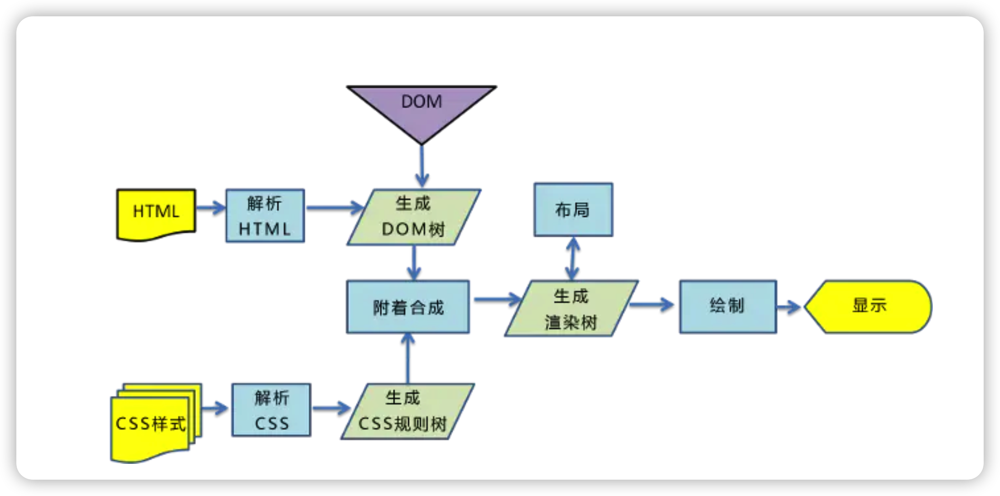

# 面试题(基础)
## 1、html

### 1.1 **你做的⻚面在哪些流览器测试过?这些浏览器的内核分别是什么**?

* 五大浏览器内核
  * Trident (踹等特) (MSHTML) (三叉戟;三叉线;三⻮⻥叉)
  * Gecko (给扣) (壁⻁)
  * Presto (pua 思透) ( 迅速的)
  * Webkit (外 be 可诶特) (Safari内核,Chrome内核原型,它是苹果公司自己的内核，也是苹果的Safari浏览器 使用的内核)
  * Blink (be 另可) (由Google和Opera Software开发的浏览器排版引擎)

* 五大浏览器内核代表作品

  * Trident:IE、Maxthon(遨游)、腾讯 、Theworld世界之窗、360浏览器

  * Gecko:代表作品Mozilla Firefox 是开源的,它的最大优势是跨平台，能在Microsoft Windows、Linux和 MacOS X等主要操作系统上运行。
  * Webkit :代表作品Safari、Chrome ， 是一个开源项目。
  * Presto :代表作品Opera ，Presto是由Opera Software开发的浏览器排版引擎。它也是世界上公认的渲染速 度最快的引擎。
  * Blink: 由Google和Opera Software开发的浏览器排版引擎，2013年4月发布。

### 1.2 h5**新增了哪些内容**？

* 语义化标签

  header，footer，nav，section，article，aside等

* 媒体标签

  audio，video

* 功能性标签

  svg，canvas

* 智能表单

  一些input的type类型，和新的input属性

* 本地存储

  localstorage和sessionstorage

* api

  websocket, fetch(浏览器自带的数据请求方式)和requestAnimationFrame(动画定时器)等等

* 新事件

  onresize, ondrag, onscroll, onmousewheel, onerror, onplay, onpause等

### 1.3 **语义化的理解?**

> 用正确的标签做正确的事情！html语义化就是让页面的内容结构化，便于浏览器、搜索引擎解析，在没有css样式的情况下也可以一种文档格式显示，并且是容易阅读的。利于SEO搜索引擎优化和代码阅读理解。

### 1.4 **什么是响应式**？

> 响应式：它是关于网页制作过程中让不同的尺寸不同功能的设备进行兼容处理，所有使用的设备上让网站运行正常。

### 1.5 localStorage, sessionStorage**和**cookie**之间的区别**？

| 特性         | cookie                             | localStorage                               | sessionStroge                  | IndexDB                                        |
| ------------ | ---------------------------------- | ------------------------------------------ | ------------------------------ | ---------------------------------------------- |
| 数据生命周期 | 一般由服务端生成，可以设置过期时间 | 持久化本地存储，除非主动删除，否则一直存在 | 持久化本地存储，页面关闭就清除 | 持久化本地存储，除非被主动删除，否则一直会存在 |
| 数据存储大小 | 4k                                 | 5M                                         | 5M                             | 无限                                           |
| 与服务端通信 | 每次都会携带在header中             | 不参与                                     | 不参与                         | 不参与                                         |

作用域不同：sessisionStorage不能在不同的浏览器窗口中共享，即使是同一个⻚面;localStorage和cookie在同 一个浏览器的所有的同源窗口中都是共享的。cookie的存取方法需要自己封装，本地存储拥有自己存取的方法。

### 1.6 websocket**协议和**http**协议的区别**？

* http协议:每次http请求都需要创建一次tcp连接，通信只能由客户端发起，做不到服务器主动向客户端推送信息。
* websocket协议: websocket是保持⻓连接，服务器可以主动向客户端推送信息，客户端也可以主动向服务器发送信息，是真正的双向平等对话，属于服务器推送技术的一种。

### 1.7 **前端优化做过哪些**

#### **网⻚内容**

- 减少http请求次数

    - 将js和css文件捆绑下载 

    - 使用雪碧图

- 减少DNS查询次数
- 避免在⻚面的主体布局使用table
- 减少DOM元素数量
- 减少iframe

#### **服务器端**

* 使用cdn加速
* 多使用GET请求
* 避免空的src图片，因为空的src图片也会进行请求

#### CSS

* 样式表写在head里面
* 使用link替代@import
* 样式少嵌套（最好三层即可）

#### JavaScript

* 写在body的最下面，让页面内容尽快渲染加载给用户
* 使用h5新增的async关键字，可以让js异步执行
* 将js和css外部引入，并且精简和压缩

#### 减少dom操作

#### 图片

* 图片预加载、懒加载
* 不要在html中缩放图片，如果有小图片，直接使用小图片

### 2、CSS

#### 2.1 元素水平垂直居中的方式?

* 弹性盒

  父元素：display: flex;

  子元素：margin: auto;

* 弹性盒2

​		父元素：display: flex;justify-content: center;align-items: center;

* 定位

  父元素：position: relative;

  子元素：position: absolute;top: 0;left:0;right:0;bottom:0;magin: auto;

* 定位+2d变形

  父元素：position: relative;

  子元素：position:absolute;top:50%;left:50%;transform:translate(-50%,-50%);

#### 2.2 **清除浮动的方式**?

* 给高度塌陷的元素添加overflow: hidden;
* 额外标签法：在最后面加一个空的div，并添加clear: both;

* 万能清除法: 

  ```css
  .clearfix::after {
  	content: '.',
  	height: 0;
  	display: block;
  	overflow: hidden;
  	visibility: hidden;
  	clear: both;
  }
  ```

* display:flow-root: 新出来的，没有副作用，但是还存在兼容性问题

#### 2.3 display**有哪些属性值**?

* block: 块状元素
* inline-block:行内块元素
* inline:行内元素
* none:隐藏元素
* flex:弹性盒
* inline-flex: 行内的弹性盒
* list-item: li的默认属性值
* table: table的默认值
* table-row: tr的默认值
* table-cell: rd的默认值
* inherit: 继承

#### 2.4 **介绍一下**em,rem,vw, vh, vmax, vmin？

* em: em是相对⻓度单位。相对于当前元素内文本的字体尺寸
* rem: rem是CSS3新增的一个相对单位，相对的是HTML根元素的字体大小。除了IE8及更早版本外，所有浏览 器均已支持rem。
* vw: 视窗宽度的百分比(1vw 代表视窗的宽度为 1%)
* vh: 视窗高度的百分比
* vmax: 当前 vw 和 vh 中较大的一个值
* vmin: 当前 vw 和 vh 中较小的一个值
* 视窗(Viewport)是浏览器实际显示内容的区域，是不包括工具栏和按钮的网⻚浏览器的内容区域。
* 做移动⻚面开发时，如果使用 vw、vh 设置字体大小(比如 5vw)，在竖屏和横屏状态下显示的字体大小是不一样的。由于 vmin 和 vmax 是当前较小的 vw 和 vh 和当前较大的 vw 和 vh。这里就可以用到 vmin 和 vmax。使得文字大小在横竖屏下保持一致。

#### 2.5 **定位有哪些?**

* static: 默认值。没有定位，元素出现在正常的文档流中(忽略 top, bottom, left, right 或者 z-index 声明)。
* relative: 相对于元素本身正常的位置进行定位，不脱离文档流，"left:20" 会向元素的 LEFT 位置移动20 像 素。
* absolute: 生成绝对定位元素，相对于第一个static定位以外的父元素进行定位，元素的位置通过 "left", "top", "right" 以及 "bottom" 属性进行规定， 相对的是父元素border的位置。
* fixed: 生成固定定位的元素，相当于浏览器窗口进行定位。
* sticky: 粘性定位，该定位基于用户滚动的位置。正常情况下，它的行为就像 position:relative; 而当⻚面滚动 超出目标区域时，它的表现就像 position:fixed;它会固定在目标位置。
* inherit: 规定从父元素继承position属性的值。
* initial: 设置属性为默认值(static)

#### 2.6 **浏览器的渲染原理**

1. 浏览器将获取的HTML文档解析成DOM Tree (DOM树)
2. 将CSS样式表解析成CSSOM Tree(CSS树)
3. 将DOM和CSSOM合并为渲染树(redering tree),这个过程被称为attachment
4. 渲染树的每个元素经过精确的计算，给出坐标，这个过程称为layout
5. 将渲染树的各个节点绘制到屏幕上，这个过程称为painting

   

#### 2.7 **从浏览器地址栏输入**url**到显示⻚面的步骤**?

1. 浏览器根据请求的URL交给DNS域名解析，找到真实的ip地址向服务器发起请求。
2. 服务器交给后台处理完成后返回数据，浏览器接受文件（HTML,CSS,JS,图像等）。
3. 浏览器对加载的资源进行语法解析，建立相应的内部数据结构。
4. 载入解析到的资源文件，渲染页面，完成。

#### 2.8 CSS3新增了哪些内容？

* 过渡 transition: CSS属性（默认all）花费时间  效果曲线（默认ease）延迟时间（默认0）

* 动画 animation: 动画名称  一个周期花费时间  运动曲线（默认ease）动画延迟（默认0）播放次数（默认1）是否反向播放动画（默认normal）是否暂停动画（默认running）

* 形状转换 transform: 适用于2d或3d转换的元素

  rotate(30deg); translate(30px,30px); scale(.8);skew(10deg,10deg); rotateX(180deg);rotateY(180deg); rotate3d(10,10,10,90deg);

* 选择器

  1. 属性选择器

  2. 结构性伪类选择器

     `:root` 等同于html; `:not`(否定选择器); `:empty`选择器表示的就是空。`:target`目标选择器，用来匹配文档(页面)的url的某个标志符的目标元素。`:first-child`表示的是选择父元素的第一个子元素的元素E。简单点理解就是选择元素中的第一个子元素，记住是子元素，而不是后代元素。`first-of-type`匹配的是父元素下相同类型子元素中的第一个，比如 p:first-of-type，就是指所有类型为p的子元素中的第一个。这里不再限制是第一个子元素了，只要是该类型元素的第一个就行了。

  3. enabled和:disabled选择器

  4. checked选择器

  5. ::selection选择器

  6. ::before和::after伪元素选择器

* 阴影 box-shadow: 水平阴影的位置 垂直阴影的位置 模糊距离 阴影大小 阴影颜色 阴影开始方向（默认从里向外，设置inset就是从外到里）

* 边框 border-image: 图片url 图像边界向内偏移 图像边界的宽度(默认为边框的宽度) 用于指定在边框外部绘 制偏移的量(默认0) 铺满方式--重复(repeat)、拉伸(stretch)或铺满(round)(默认:拉伸 (stretch))

* 背景 background-clip(制定背景绘制(显示)区域) background-origin background-size

  background-clip: border-box; 默认情况(从边框开始绘制)

  background-clip: padding-box; 从padding开始绘制(显示)，不算border,，相当于把border那里的背景给裁剪掉

  background-clip: content-box;只在内容区绘制(显示)，不算padding和border，相当于把padding和 border那里的背景给裁剪掉

* 反射 -webkit-box-reflect:方向[ above-上 | below-下 | right-右 | left-左 ]，偏移量，遮罩图片

* 文字 word-break: normal|break-all|keep-all; 

​		换行 word-wrap: normal|break-word;

​		超出省略号 text-overflow:clip|ellipsis|string;

​		文字阴影 text-shadow:水平阴影，垂直阴影，模糊的距离，以及阴影的颜色。

* 颜色 rgba(rgb为颜色值，a为透明度) color: rgba(255,00,00,1);background: rgba(00,00,00,.5); hsla h:色 相”，“s:饱和度”，“l:亮度”，“a:透明度” color: hsla( 112, 72%, 33%, 0.68);background-color: hsla( 49, 65%, 60%, 0.68);
* 渐变 
* Filter(滤镜):黑白色filter: grayscale(100%)、褐色filter:sepia(1)、饱和度saturate(2)、色相旋转hue- rotate(90deg)、反色filter:invert(1)、透明度opacity(.5)、亮度brightness(.5)、对比度contrast(2)、模糊 blur(3px)
* 弹性布局 flex
* 网格布局 grid

* 多列布局

* 盒模型定义 

  box-sizing:border-box的时候，边框和padding包含在元素的宽高之内

  box- sizing:content-box的时候，边框和padding不包含在元素的宽高之内

* 媒体查询: 就是监听屏幕尺寸的变化，在不同尺寸的时候显示不同的样式!在做响应式的网站里面，是必不可少的一环

#### 2.9 过渡和动画的区别？

* 过渡需要用户手动触发，而动画不需要
* 过渡不能控制中间过程，动画可以
* 过渡只能执行一次，动画可以执行任意次

#### 2.10 什么是回流和重绘？

**什么是回流？**

> 通过构造render tree,我们可以将DOM节点以及它对应的样式结合起来，可是我们还需要计算它们的设备视口（viewport）内的确切位置和大小，这个计算的阶段就叫回流。
>
> 当render tree 中的一部分（或全部）因为元素的规模尺寸，布局，隐藏等改变而需要重新构建时，这就称为回流（reflow）。每个页面至少有一次回流，就是页面在第一次加载的时候，这时候一定会发生回流，因为要构建render tree。

**什么是重绘？**

> 当render tree 中的一些元素需要更新属性时，而这些属性只是影响元素的外观、风格而不会影响布局的时候，比如：background-color、文字颜色、边框颜色等，则称为重绘。

**区别**

> 回流必定会发生重绘，而重绘不一定发生回流。回流所需要花费的成本比重绘高很多，改变父节点里的子节点很可能会导致父节点的一系列发生回流。

**何时会发生回流？**

* 页面第一次渲染
* 添加或删除可见的DOM元素时
* 元素的位置发生变化
* 元素的尺寸发生变化（包括外边距、内边距、边框大小、高度和宽度等）
* 内容发生变化 比如：文本变化或图片被另一个不同的尺寸的图片所替代或者字体改变
* 浏览器窗口尺寸的变化（因为回流是根据视口的大小来计算元素的位置和大小的）
* 定位或者浮动，盒模型等
* 获取元素的某些属性

**如何减少重绘和回流？**

* 使用tranform做形变和位移来替代定位top
* 使用visibility替代display: none;因为前者只会引起重绘，而后者会发生回流
* 不要使用table布局，可能很小的一个改变会造成整个table的重新布局
* 动画实现的速度选择，动画速度越快，回流的次数越多，也可以选择使用requestAnimationFrame
* CSS选择器会从右往左匹配查找，因此需要避免层级过多
* 将频繁重绘或回流的节点设置为图层，图层能够阻止该节点渲染行为影响别的节点。比如video标签，浏览器 会自动将该节点变为图层
* 避免多次读取某些属性
* 合并多次对DOM和样式的修改，然后一次处理掉

#### 2.11  弹性盒（flex）

**父元素**

```css
display:
- flex-direction:设置主轴方向
- justify-content:设置主轴对⻬方式
- align-items:设置侧轴对⻬方式
- flex-wrap 设置是否换行
- align-content : 行与行之间的排列方式
```

**子元素**

```css
- align-self: 设置单独在侧轴对⻬方式 - order: 设置排列顺序
- flex-grow: 放大比例
- flex-shrink: 缩小比例
- flex-basis: 分配剩余空间前占据的位置
- flex: flex-grow,flex-shrink,flex-basis的缩写
```

#### 2.12 盒模型有几种?

* 标准盒模型:margin，border，padding，content

​		宽 = 左右border + 左右margin + 左有padding + width

* 怪异盒模型（IE盒模型）:border和padding算在宽高的里面

​		宽 = width

#### 2.13 移动端适配怎么做？

1. 可以使用手机淘宝之前的方案 flexible.js插件
2. 使用less或者sass等css预编译的mixin混合计算，带参数进行自动计算
3. 使用最新的postcss的postcss-pxtorem插件和lib-flexible插件
4. 使用rem+vw进行布局

#### 2.14 rgba()**和** opacity 的透明效果有什么不同?

rgba()和 opacity 都能实现透明效果，但最大的不同是opacity作用于元素，以及元素的所有内容的透明度，而rgba()只作用于元素的颜色或其背景色。(设置 rgba 透明的元素的子元素不会继承透明效果!)

#### 2.15 什么是BFC？

> BFC: block formatting context(块状格式化上下文)
>
> bfc是一个独立的空间，只有块状元素参与， 它规定了里面的块状元素如何布局，它和外部的环境毫不相干。

**触发条件**

```css
1. 根元素(html)本身就是一个BFC
2. float不能none的时候
3. position为absolute或者fixed的时候
4. display为inline-block, table-cell, flex, inline-flex等 
5. overflow不为visible的时候
```

**特点**

```css
1.bfc区域的元素从上到下一次排列
2.相邻的上下元素垂直方向的距离由margin控制，具体以margin值大的为准
3.bfc区域里面的元素的margin-left与bfc区域的border-left相接触
4.bfc区域与外界毫不相干
5.bfc区域不会与float元素相重叠
6.计算bfc区域,浮动元素参与计算
```

#### 2.16 CSS中哪些属性可以继承?

* 字体系列属性

  font-family:字体系列

  font-weight:字体的粗细

  font-size:字体的大小

  font-style:字体的⻛格

* 文本系列属性

  text-indent:文本缩进

  text-align:文本水平对⻬

  line-height:行高

  word-spacing:单词之间的间距

  letter-spacing:中文或者字母之间的间距

  text-transform:控制文本大小写(就是uppercase、lowercase、capitalize这三个) 

  color:文本颜色

* 元素可⻅性

  visibility:控制元素显示隐藏

* 列表布局属性

  list-style:列表⻛格，包括list-style-type、list-style-image等

* 光标属性

  cursor:光标显示为何种形态

#### 2.17 行内元素和块级元素的区别？

1. 行内元素会在一条直线上排列（默认宽度只与内容有关），都是同一行的，水平方向排列。块级元素各占据一行（默认宽度是它本身父容器的100%（和父元素的宽度一致），与内容无关），垂直方向排列。
2. 块级元素可以包含行内元素和块级元素。行内元素不能包含块级元素，只能包含文本或者其它行内元素。
3. 行内元素设置width无效，height无效(可以设置line-height)，margin上下无效，padding上下无效

#### 2.18 CSS权重

!important>行内样式>id>class|属性>标签选择器>通配符

包含选择器的权重等于每一级选择器的权重之和

#### 2.19 CSS选择器有哪些？

* 通配符
* id选择器
* class选择器
* 元素选择器
* 后代选择器
* 层级选择器
* 属性选择器
* 兄弟选择器
* 结构选择器
  * 结构伪类
  * 目标伪类
  * ui状态伪类
  * 动态伪类
  * 否定伪类
* 等

#### 2.19 如何清除图片之间的间隙？

* 清除图片左右的间隙
  1. 图片挨着写（中间没有空格，也没有回车）
  2. 将图片的父元素的font-size设置为0
  3. 给图片加浮动
* 清除图片的上下边距
  1. 将图片设置成display: block
  2. 给图片设置vertical-align: top/middle/bottom

#### 2.20 stylus/sass/less区别?

* 均具有“变量”、“混合”、“嵌套”、“继承”、“颜色混合”五大基本特性
* Sass和Less语法较为严谨，Less要求一定要使用花括号“{}”，Scss和Stylus可以通过缩进表示层次与嵌套关系

* Sass无全局变量的概念,Less和Stylus有类似于其它语言的作用域概念

* Sass是基于Ruby语言的，而Less和Stylus可以基于NodeJS NPM下载相应库后进行编译

## 2、JavaScript

### 2.1  js的数据类型有哪些？

* 基本数据类型（5种）string,number,null,undefined,boolean
* 复杂数据类型（1种）Object,Function,Array
* es6新增（1种基本数据类型）symbol
* es11新增（1种基本数据类型）BigInt

### 2.2 js的变量声明方式

* var 
* let 
* const
* function
* import
* class

### 2.3 let、const、var 的区别？

* let 和const是es6新增的声明类型
* let用于声明变量，const用于声明常量（如果是一个对象，只改变里面的一个属性，最好也是用const）
* let和const都有块级作用域，不具备变量提升（会有暂时性死区），不能重复声明
* var的作用域是全局性的，存在变量提升，可以前置访问，可以重复声明 

#### 2.4 **如何判断一个变量的类型，以及**typeof**和**instanceof的区别？

* typeof 和instanceof常用来判断一个变量是否为空，或者是什么类型

* typeof的返回值是一个字符串，用来说明变量的数据类型

* typeof一般只能返回如下几个结果：number,boolean,string,function,object,undefined

  其中对象、数组、null以及window、document的值都是object

* instanceof的返回值是布尔值
* instanceof用于判断一个变量是否属于某个对象的实例

#### 2.5 用过哪些数组排序的方法

**冒泡排序**

```javascript
// 冒泡排序: 比较两个相邻的项，如果第一个大于第二个则交换他们的位置,元素项向上移动至正确的顺序，就好像气泡往上冒一样
function bubbleSort(arr) {
  let len = arr.length
  for(let i=0;i<len-1;i++) {
    for(let j=0;j<len-1-i;j++) {
      if(arr[j]>arr[j+1]) {
        arr[j] = arr[j]^arr[j+1]
        arr[j+1] = arr[j]^arr[j+1]
        arr[j] = arr[j]^arr[j+1]
      }
    }
  }
  return arr
}
```

**快速排序**

```javascript
/*
	1、首先，在数组中选择一个中间项作为基数
	2、准备两个数组容器，遍历数组，逐个与基数比对，较小的放左边容器，较大的放右边容器
	3、进行相同的操作，直到数组中只有一个元素时，返回该数组
*/
function quickSort(arr) {
  	let len = arr.length
    if (len <= 1) {
      // 基点
      return arr
    } else {
      // 中间索引
      let midIndex = parseInt(arr.length / 2)
      // 中间值
      let midValue = arr[midIndex]
      // 定义两个数组用于分别存放比中间值小/大的值
      let left = [],right = []
      for (let i = 0; i < len; i++) {
        if (arr[i] < midValue) {
          // 存放到左边数组
          left.push(arr[i])
        } else if (arr[i] > midValue) {
          // 排序+去重
          right.push(arr[i])
        }
      }
      return quickSort(left).concat(midValue, quickSort(right))
    }
 }
```

**选择排序**

```javascript
/*
	（1）在未排序序列中找到最小（大）元素
	（2）并存放到排序序列的起始位置
	（3）然后，再从剩余未排序元素中继续寻找最小（大）元素
	（4）然后放到已排序序列的末尾。
	（5）以此类推
*/
function selectionSort(arr) {
  let len = arr.length
  let minIndex
  for(let i=0;i<len-1;i++) {
    minIndex = i
    for(let j=i+1;j<len;j++) {
      if (arr[j]<arr[minIndex]) {
        minIndex = j
      }
    }
    [arr[i], arr[minIndex]] = [arr[minIndex], arr[i]]
  }
  return arr
}
```

**插入排序**

```javascript
/*
	（1）从第一个元素开始，该元素可以认为已经被排序
	（2）取出下一个元素，在已经排序的元素序列中扫描
	（3）如果该元素（已排序）大于新元素，将该元素移到下一位置
	（4）重复步骤3，直到找到已排序的元素小于或者等于新元素的位置
	（5）将新元素插入到下一位置中
	（6）重复步骤2
*/
function insertionSort(arr) {
  let len = arr.length
  for(let i=1;i<len;i++) {
    let temp = arr[i]
    let j = i
    while(j>0) {
      if (temp<arr[j-1]) {
        arr[j] = arr[j-1]
      } else {
        break
      }
      j--
    }
    arr[j] = temp
  }
  return arr
}
```

**归并排序**

```javascript
/* 
	Mozilla Firefox 使用归并排序作为Array.prototype.sort的实现，而chrome使用快速排序的一个变体实现的,前面三种算法性能不好，但归并排序性能不错 算法复杂度O(nlog^n)
  归并排序是一种分治算法。
  1、将序列分成两个长度为n/2的子序列
	2、再将每个子序列分成两个m/2个子序列，直到长度为1
	3、将两个排序好的子序列合并成一个新序列，得到最终序列

*/
function mergeSort(arr) {
  const len = arr.length
  // 序列长度为1时退出
  if (len < 2) {
    return arr
  }
  // 将序列分为两个子序列，这一块用到“分治法”中的“分割”
  const middle = Math.floor(len/2)
  const left = arr.slice(0,middle)
  const right = arr.slice(middle)
  // 递归，这一块用到“分治法”中的“集成（合并）”
  return merge(mergeSort(left),mergeSort(right))
}

function merge(left,right) {
	const result = []
  // 两个子序列进行比较，从小到大放入新的序列result中
  while(left.length && right.length) {
    // 将较小的放入result,并改变left或者right的长度，灵活使用shift方法
    if (left[0]<=right[0]) {
      result.push(left.shift())
    } else {
      result.push(right.shift())
    }
  }
  result.push(...left)
  result.push(...right)
  return result
}
```

#### 2.6 类型转换

**转Boolean**

```javascript
在条件判断时，除了 undefined， null， false， NaN， ''， 0， -0，其他所有值都转为 true，包括所有对象。
```

**对象转基本类型**

```javascript
 对象在转换基本类型时，首先会调用 valueOf 然后调用 toString。并且这两个方法你是可以重写的。
 let a = {
   valueOf() {
     return 0
   }
 }
 当然你也可以重写 Symbol.toPrimitive ，该方法在转基本类型时调用优先级最高。
 let a = {
   valueOf() {
     return 0
   }
   toString() {
     return 1
   }
	 [Symbol.toPrimitive]() {
     return 2
   }
 }
 console.log(1+a) // 3
 console.log('1'+a) // '12'
```

**四则运算符**

```javascript
只有当加法运算时，其中一方是字符串类型，就会把另一个也转为字符串类型。其他运算只要其中一方是数字，那么另
一方就转为数字。并且加法运算会触发三种类型转换:将值转换为原始值，转换为数字，转换为字符串。
1 + '1' // '11'
2 * '2' // 4
[1, 2] + [2, 1] // '1,22,1'
// [1, 2].toString() -> '1,2'
// [2, 1].toString() -> '2,1'
// '1,2' + '2,1' = '1,22,1' 

// 对于加号需要注意这个表达式 'a' + + 'b'
'a' + + 'b' // -> "aNaN"
// 因为 +'b'->NaN
// 你也许在一些代码中看到过 + '1' -> 1
```

**== 操作符**

```javascript
 
比较运算x==y，其中x和y是值，产生true或者false。这样的比较按如下方式进行:
1.若Type(x)与Type(y)相同，则 
	a.若Type(x)为Undefined,返回true。 
	b.若Type(x)为Null，返回true。 
  c.若Type(x)为Number，则
		i.若x为NaN,返回false。 
			ii.若y为NaN,返回false。
		ili.若x与y为相等数值，返回true。 
			iv.若x为+0且y为-0，返回true。 
      	v.若x为-O且y为+0，返回true。
			vi.返回false。 
	d.若Type(x)为String，则当x和y为完全相同的字符序列(⻓度相等且相同字符在相同位置)时返回true。否则返
回false。 
	e.若Type(x)为Boolean，当x和y为同为true或者同为false时返回true。否则返回false。
  f.当x和y为引用同一对象时返回true。否则返回false。
2.若x为null且y为undefined，返回true。
3.若x为undefined且y为null，返回true。
4.若Type(x)为 Number且 Type(y)为String，返回comparison x == ToNumber(y)的结果。 
5.若Type(x)为String 且 Type(y)为Number,
6.返回比较ToNumber(x)== y的结果。
7.若Type(x)为Boolean,返回比较ToNumber(x)== y的结果。
8.若Type(y)为Boolean,返回比较x == ToNumber(y)的结果。
9.若Type(x)为String或Number，且Type(y)为Object，返回比较x == ToPrimitive(y)的结果。 
10.若Type(x)为Object且Type(y)为String或Number，返回比较ToPrimitive(x)== y的结果。 11.返回false。
 	
```

#### 2.7 原型

* 每个函数都有prototype属性，除了Function.prototype.bind(),该属性指向原型
* 每个对象都有__proto__属性，指向创建该对象的构造函数的原型。其实这个属性指向了[[prototype]],但是[[prototype]]是内部属性，我们并不能访问到，所以使用__proto__来访问

* 对象通过__proto__来寻找不属于该对象的属性或方法，__proto__将对象连接起来组成了原型链

#### 2.8 什么是原型链？

原型链：当访问一个对象的某个属性时，首先会从该对象的自己属性中查找，如果没有找到，就会从它的__proto__隐式原型上查找，即它的构造函数的原型prototype，如果还没有找到，就会去构造函数的prototype的__proto__中查找，这样一层一层的往上就会形成一条链式结构，我们称为原型链。

#### 2.9 new的过程做了什么？

1. 新生成了一个对象
2. 链接到原型上
3. 绑定this
4. 返回新对象

#### 2.10 this

1. 普通函数的this指向调用这个函数的对象，默认是window
2. 构造函数的this指向new出来的这个对象，而且优先级是最高的，不能被改变
3. 箭头函数的this指向的是它外面的第一个不是箭头函数的this，在定义时就确定了，不能被改变
4. 事件处理函数的this指向事件对象

#### 2.11 call, apply, bind 区别？

* call 和 apply 都是为了解决改变 this 的指向。作用都是相同的，只是传参的方式不同。

* 除了第一个参数外，call 可以接收一个参数列表，apply 只接受一个参数数组。
* bind 和其他两个方法作用也是一致的，只是该方法会返回一个函数。并且我们可以通过 bind 实现柯里化。

#### 2.12 闭包

**闭包的定义：**当一个内部函数被调用就会形成闭包，闭包就是能够读取其他函数内部变量的函数。

**闭包的作用：**

1. 在外部访问函数内部的变量
2. 让函数内部的局部变量可以一直保存下去

**闭包的缺点：**占用内存空间，大量的使用闭包可能会造成栈溢出

**闭包的优化：**由于闭包会一直占用内存，知道页面销毁，可以主动将已使用的闭包进行销毁，将闭包函数赋值为null

#### 2.13 深浅拷⻉

```javascript
let a = { 
  age: 1
}
let b = a
a.age = 2
console.log(b.age) // 2
```

从上述例子中我们可以发现，如果给一个变量赋值一个对象，那么两者的值会是同一个引用，其中一方改变，另

一方也会相应改变。通常在开发中我们不希望出现这样的问题，我们可以使用浅拷⻉来解决这个问题。

**浅拷贝**

```javascript
// 1.使用Object.assign()
let a = {
  age: 18
}
let b = Object.assign({},a)
a.age = 20
console.log(b.age) // 18

// 2.展开运算符
let a = {
  age: 18
}
let b = {...a}
a.age = 20
console.log(b.age) // 18
```

通常浅拷⻉就能解决大部分问题了，但是当我们遇到如下情况就需要使用到深拷⻉了

```javascript
let a = {
  age: 18,
  jobs: {
    first: 'YE'
  }
}
let b = {...a}
a.jobs.first = 'native'
console.log(b.jobs.first) // native
// 浅拷⻉只解决了第一层的问题，如果接下去的值中还有对象的话，那么就又回到刚开始的话题了，两者享有相同的引用。要解决这个问题，我们需要引入深拷⻉
```

**深拷贝**

```javascript
let a = {
  age: 18,
  jobs: {
    first: 'YE'
  }
}
let b = JSON.parse(JSON.stringify(a))
a.jobs.first = 'native'
console.log(b.jobs.first) // YE
/*
	但是该方法也是有局限性的:
		- 会忽略 undefined
    - 会忽略 symbol
    - 不能序列化函数
    - 不能解决循环引用的对象
  如果遇到这些情况，可以使用递归或者 lodash 的深拷⻉函数
*/

```

#### 2.14 防抖

防抖和节流的作用都是防止函数多次调用。区别在于，假设一个用户一直触发这个函数，且每次触发函数的间隔小于wait，防抖的情况下只会调用一次，而节流的情况会每隔一定时间(参数wait)调用函数。

我们先来看一个袖珍版的防抖理解一下防抖的实现:

```javascript
const debounce = (func,wait=50)=> {
	// 缓存一个定时器id
  let timer = 0
  // 这里返回的函数是每次用户实际调用的防抖函数
  // 如果已经设定过定时器了就清空上一次的定时器
  // 开始一个新的定时器，延迟执行用户传入的方法
  return function(...args) {
    if(timer) clearTimeout(timer)
    timer = setTimeout(()=> {
      func.apply(this,args)
    },wait)
  }
}
// 不难看出如果用户调用该函数的间隔小于wait的情况下，上一次的时间还未到就被清除了，并不会执行函数
```

这是一个简单版的防抖，但是有缺陷，这个防抖只能在最后调用。一般的防抖会有immediate选项，表示是否立 即调用。这两者的区别，举个栗子来说:

* 例如在搜索引擎搜索问题的时候，我们当然是希望用户输入完最后一个字才调用查询接口，这个时候适用延迟 执行的防抖函数，它总是在一连串(间隔小于wait的)函数触发之后调用。 
* 例如用户给interviewMap点star的时候，我们希望用户点第一下的时候就去调用接口，并且成功之后改变star 按钮的样子，用户就可以立⻢得到反馈是否star成功了，这个情况适用立即执行的防抖函数，它总是在第一次 调用，并且下一次调用必须与前一次调用的时间间隔大于wait才会触发。

下面我们来实现一个带有立即执行选项的防抖函数

```javascript
/**
* 防抖函数，返回函数连续调用时，空闲时间必须大于或等于 wait，func 才会执行 *
* @param  {function} func
* @param  {number}   wait
* @param  {boolean}  immediate
* @return {function}
*/
function debounce (func, wait = 50, immediate = true) {
  let timer, context, args
  // 延迟执行函数
  const later = () => setTimeout(() => {
    // 延迟函数执行完毕，清空缓存的定时器序号 timer = null
    // 延迟执行的情况下，函数会在延迟函数中执行 // 使用到之前缓存的参数和上下文
    if (!immediate) {
      func.apply(context, args)
      context = args = null
    }
  }, wait)
	// 这里返回的函数是每次实际调用的函数 
  return function(...params) {
  // 如果没有创建延迟执行函数(later)，就创建一个 
    if (!timer) {
      timer = later()
      // 如果是立即执行，调用函数 // 否则缓存参数和调用上下文
    	if (immediate) {
        func.apply(this, params)
      } else {
        context = this
        args = params
      }
    // 如果已有延迟执行函数(later)，调用的时候清除原来的并重新设定一个 // 这样做延迟函数会重新计时
    } else {
      clearTimeout(timer)
      timer = later()
    }
	}
}
```

整体函数实现的不难，总结一下。

* 对于按钮防点击来说的实现:如果函数是立即执行的，就立即调用，如果函数是延迟执行的，就缓存上下文和 参数，放到延迟函数中去执行。一旦我开始一个定时器，只要我定时器还在，你每次点击我都重新计时。一旦 你点累了，定时器时间到，定时器重置为 null，就可以再次点击了。
* 对于延时执行函数来说的实现:清除定时器ID，如果是延迟调用就调用函数

#### 2.15 节流

防抖是将多次执行变为最后一次执行，节流是将多次执行变成每隔一段时间执行。

```javascript
function throttle(func,wait) {
  let startTime = Date.now()
  return function() {
    let now = Date.now()
    if(now - startTime >= wait) {
      func.apply(this,args)
      startTime = now
    }
  }
}
```

#### 2.16 Promise

Promise是ES6新增的语法，解决了回调地狱的问题。

可以把Promise看成是一个状态机。初始状态为pending状态，可以通过函数resolve和reject，将状态转变为resolved或者rejected状态，状态一旦改变就不可以再次改变。

then函数会返回一个Promise实例，并且该返回值是一个新的实例而不是之前的实例。因为Promise规范规定除了pending状态，其他状态都是不可变的，如果返回的是一个相同的实例的话，多个then调用就会失去意义了。

Promise还拥有很多api:

- then
  - catch
  - all
  - race
  - finally

#### 2.17 async和await

一个函数如果加上async，那么该函数就会返回一个Promise

```javascript
async function test() {
  return '1'
}
console.log(test()) // Promise{<resolved>: '1'}
```

可以把async看成将函数返回值使用Promise.resolve()包裹了下。

```javascript
function sleep() {
  return new Promise(resolve=> {
    setTimeout(()=> {
      console.log('finish')
      resolve('sleep')
    },2000)
  })
}
async function test() {
  let value = await sleep()
  console.log('object')
}
test()
```

上面代码会先打印 finish 然后再打印 object 。因为 await 会等待 sleep 函数 resolve ，所以即使后面是同步代 码，也不会先去执行同步代码再来执行异步代码。

sync 和 await 相比直接使用 Promise 来说，优势在于处理 then 的调用链，能够更清晰准确的写出代码。缺点 在于滥用 await 可能会导致性能问题，因为 await 会阻塞代码，也许之后的异步代码并不依赖于前者，但仍然需要 等待前者完成，导致代码失去了并发性。

下面来看一个使用 await 的代码。

```javascript
var a = 0
var b = asysc() => {
  a = a + await 10
  console.log('2',a) // '2' 10
  a = (await 10) + a 
  console.log('3',a) // '3' 20
}
b()
a++
console.log('1',a) // '1' 1
```

对于以上代码可能会有疑惑，这里说明下原理

* 首先函数 b 先执行，在执行到 await 10 之前变量 a 还是 0，因为在 await 内部实现了 generators ， generators 会保留堆栈中东⻄，所以这时候 a = 0 被保存了下来

* 因为 await 是异步操作，遇到await就会立即返回一个pending状态的Promise对象，暂时返回执行代码的控 制权，使得函数外的代码得以继续执行，所以会先执行 console.log('1', a) 
* 这时候同步代码执行完毕，开始执行异步代码，将保存下来的值拿出来使用，这时候 a = 10 
* 然后后面就是常规执行代码了

#### 2.18 解构

ES6允许按照一定模式，从数组和对象中提取值，对变量进行赋值，这被称为解构。

举例：

- let a = 1; let b = 2; [b, a] = [a, b];
- import {Component} from 'react'
- import {getTableData} from '../api.js'
- getTableData().then(res => {let { data } = res})

#### 2.19 箭头函数

1. 写法简单

```
 省略function关键字，如果只有一个参数可以省略小括号，代码块只有一条语句，可以省略大括号，省略大括号还有 自动return的作用，等等
```

2. this指向更加明确

```
箭头函数的this指向的是它外面的第一个不是箭头函数的函数的 this
```

#### 2.20 Set

ES6 提供了新的数据结构 Set。它类似于数组，但是成员的值都是唯一的，没有重复的值，所以Set方法一般用来 数组去重

```javascript
let arr = [2, 3, 3, 4, 6, 5, 3, 4, 4];
let arr2 = [...new Set(arr)];
```

这里new Set出来的不是真正的数组，所以需要用到...扩展运算符

#### 2.21 高阶函数

* forEach
* map
* some
* every
* filter
* reduce

#### 2.22 V8 下的垃圾回收机制

V8 实现了准确式 GC，GC 算法采用了分代式垃圾回收机制。因此，V8 将内存(堆)分为新生代和老生代两部

分。

**新生代算法**

```
新生代中的对象一般存活时间较短，使用 Scavenge GC 算法。
在新生代空间中，内存空间分为两部分，分别为 From 空间和 To 空间。在这两个空间中，必定有一个空间是使用 的，另一个空间是空闲的。新分配的对象会被放入 From 空间中，当 From 空间被占满时，新生代 GC 就会启动了。算法会检查 From 空间中存活的对象并复制到 To 空间中，如果有失活的对象就会销毁。当复制完成后将 From 空间 和 To 空间互换，这样 GC 就结束了。
```

**老生代算法**

```
老生代中的对象一般存活时间较⻓且数量也多，使用了两个算法，分别是标记清除算法和标记压缩算法。 在讲算法前，先来说下什么情况下对象会出现在老生代空间中:
- 新生代中的对象是否已经经历过一次 Scavenge 算法，如果经历过的话，会将对象从新生代空间移到老生代空间 中。
- To 空间的对象占比大小超过 25 %。在这种情况下，为了不影响到内存分配，会将对象从新生代空间移到老生代空 间中。
在老生代中，以下情况会先启动标记清除算法: - 某一个空间没有分块的时候
- 空间中被对象超过一定限制
- 空间不能保证新生代中的对象移动到老生代中
```

#### 2.23 eventloop

浏览器中js的执行流程和Node.js中流程都是基于事件循环的。

首先为什么js是单线程？

```
js的单线程是与它的用途有关，作为浏览器脚本语言，js主要的用途是与用户交互、以及操作DOM。这就决定了它只能是单线程，否则会带来很复杂的同步问题。比如，假定JavaScript同时有两个线程，一个线程在某个DOM节点上添加内容，另一个线程删除了这个节点，这时浏览器应该以哪个线程为准？所以，为了避免复杂性，从一诞生，JavaScript就是单线程，这已经成了这门语言的核心特征，将来也不会改变。
为了利用多核CPU的计算能力，HTML5提出Web Worker标准，允许JavaScript脚本创建多个线程，但是子线程完全受主线程控制，且不得操作DOM。所以，这个新标准并没有改变JavaScript单线程的本质。
```

什么是同步任务和异步任务？

* 同步任务: 就是前一个任务执行完成后，再执行下一个任务，程序的执行顺序与任务的排列顺序是一致的、同步的；
* 异步任务: 异步执行的任务，不进入主线程， 而是在异步任务有了结果后，将注册的回调函数放入任务队列中等待主线程空闲的时候读取执行。

**js事件循环**：

​	事件循环是指js执行环境中存在主执行线程和任务队列(Task Queue)，其中所有同步任务都在主执行线程中形成一个执行栈，所有的异步任务都会放到任务队列中。事件循环会经历如下过程：

* 主线程执行同步任务，在主线程执行过程中，不断形成堆栈并执行出栈入栈操作
* 主线程任务是否执行完毕，如否，继续循环第一步，如是，则进入下一步
* 系统读取任务队列里的任务，进入执行栈，开始执行
* 不断循环执行前三步

在JavaScript中，除了广义的同步任务和异步任务，还可以细分，一种是宏任务（MacroTask）也叫Task，一种叫微任务（MicroTask）。

每次单个**宏任务**执行完毕后， 检查**微任务**队列是否为空， 如果不为空，会按照**先入先出**的规则全部执行完**微任务**后， 清空微任务队列， 然后再执行下一个**宏任务**，如此循环。

如何区分宏任务与微任务呢？

* 宏任务：macrotask，又称为task, 可以理解为每次执行栈执行的代码就是一个宏任务（包括每次从事件队列中获取一个事件回调并放到执行栈中执行）。一般包括：script(可以理解为外层同步代码)、setTimeout、setInterval 、setImmediate、I/O操作

* 微任务：microtask, 又称为job, 可以理解是在当前 task 执行结束后立即执行的任务。包括：Promise.then/cath /finally回调（平时常见的）、 MutationObserver回调（html5新特性）

为什么要有微任务呢？

因为事件队列其实是一个“先进先出”的数据结构，排在前面的事件会优先被主线程读取， 那如果突然来了一个优先级更高的任务，还让去人家排队，就很不理性化， 所以需要引入微任务。

**在当前的微任务没有执行完成时，是不会执行下一个宏任务的。**

