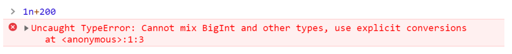
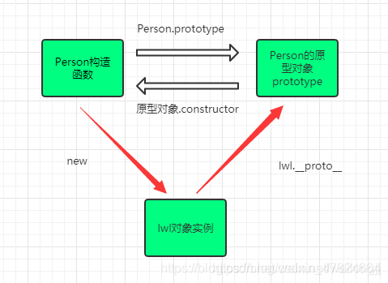
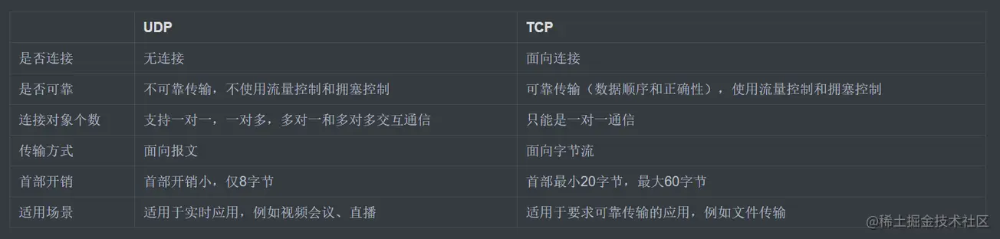

## JS面试题

### 1.正则表达式

```javascript
\d 匹配数字 \D 匹配非数字 \w 匹配数字字母下划线 \W 匹配非数字字母下划线
\n 匹配一个换行符 \s 匹配任何不可⻅字符包括空格、制表符、换⻚符等等 \S 匹配任何可⻅字符 ^ 匹配输入字行首 $匹配输入行尾 *(0到多次)匹配前面的子表达式任意次
+(1到多) 匹配前面的子表达式一次或多次(大于等于1次)
?(0或1)匹配前面的子表达式零次或一次
{n}n是一个非负整数，匹配确定的n次
{n,}n是一个非负整数。至少匹配n次
```

### 2.Ajax

我对ajax的理解是，它是一个浏览器异步通讯的方法，通过直接js脚本向服务器发起http请求，然后服务器返回数据，更新网页的相应部分，不会刷新整个页面的一种方法。

```javascript
// 1.创建ajax对象
var xhr = new XMLHttpRequest();
// 2.配置 Ajax请求地址
xhr.open('get','index.html',true);
// 3.发起请求
xhr.send(null); 
// 4.监听请求，接收响应
xhr.onreadyStateChange = function(){
  if(xhr.readyState === 4 && xhr.status === 200 || xhr.status === 304) {
    console.log(xhr.responseXML)
  }
}
```

### 3.js 延迟加载的方式

js的加载、解析和执行会阻塞页面的渲染过程，因此我们希望js脚本能够尽可能的延迟加载，提高页面的渲染速度。

我了解到的几种方法如下：

1. 将js脚本放到文档的底部，使js脚本尽可能的在最后来加载执行。
2. js脚本添加defer属性，这个属性会让脚本的加载与文档的进行同步解析，然后解析完成后再执行这个js脚本，这样就不会造成页面渲染的阻塞。如果设置了多个defer属性，按规范来说，最后执行是按顺序执行的。
3. js脚本添加async属性，这个属性会让脚本进行异步加载，它不会阻塞页面的解析过程，但是脚本一旦加载完成，就会立即执行，如果这个时候文档还没有解析完成的话，同样是会造成阻塞的。如果设置多个async属性，脚本执行的顺序是不可预测的。
4. 动态创建DOM标签的方式，对文档加载事件进行监听，当文档加载完成后，然后动态创建script标签来引入js脚本。

### 4.模块化开发的理解

我对模块化开发的理解如下：

一个模块就是实现一个特定功能的一组方法。在最开始的时候，js只实现一些简单的功能，所以没有模块化的概念，但是后来随着程序越来越复杂，代码的模块化开发就变得越来越重要。

由于函数具有独立作用域的特点，最原始的方法是使用函数来做模块，几个函数作为一个模块，但是这种方式容易造成全局变量污染，并且模块之间没有联系。

后来提出了对象写法，通过将函数作为一个对象的方法来实现，这样就解决了直接使用函数作为模块的一些缺点，但是这种方法会暴露所有的模块成员，外部代码是可以修改内部属性的值。

现在最常用的是立即执行函数的写法，通过利用闭包来实现模块化私有作用域，同时不会对全局作用域造成污染。

### 5.js 的几种模块规范

js中现在有比较成熟的四种模块加载方案：

一、CommonJS方案，它通过require来引入模块，通过module.exports定义模块的输出接口。这种模块解决方案主要是用于服务端的，因为它是使用同步的方式来引入模块，所以不适合用于浏览器端，因为浏览器端是需要进行网络请求的，可能会造成阻塞，使用异步加载方式更适合。

二、AMD模块，这种方案采用的是异步加载的方式来引入模块，模块的加载不影响后面语句的执行，所有依赖这个模块的语句都定义在一个回调函数中，等到加载完成后再执行回调函数。require.js实现了AMD规范。

三、CMD模块，这种方案和AMD方案都是为了解决异步模块加载的问题，sea.js实现了这CMD的规范。它和require.js的区别就是在于模块定义时和对依赖模块的执行时机处理不同。

四、ES6提出的方案，使用import和export的形式来导入导出模块。

### 6.AMD**和**CMD规范的区别?

它们主要区别有两方面：

1. 在模块定义时对模块依赖处理不同。AMD推崇依赖前置，在模块定义的时候就要声明其依赖的模块。而CMD推崇就近依赖，只有在用到这个模块的时候再去require。
2. 对依赖模块的执行时机不同。首先AMD和CMD对于模块的加载方式都是异步加载，不过它们的区别在于模块的执行时机，AMD在依赖模块加载完成时就直接执行依赖模块，依赖模块的执行顺序和我们书写的顺序不一定一致。而CMD在依赖模块加载完成后并不执行，等到所有依赖都加载好了，才进入回调函数执行require，这样就保证了模块的执行顺序和我们书写的顺序一致。

### 7.ES6**模块与**CommonJS 模块区别？

1. CommonJS模块输出的是一个值的拷贝，ES6模块输出的是值的引用。
2. CommonJS模块是运行时加载，ES6模块是编译时输出接口。CommonJS模块就是对象，即输入时先加载整个模块，输出一个对象，然后再这个对象上读取方法，这个加载称为"运行时加载"，而ES6模块不是对象，它的对外接口只是一种静态定义，在代码静态解析阶段就会生成。

### 8.requireJS的核心原理

require.js的核心原理就是通过动态创建script标签来异步引入模块，然后对每个脚本的load事件进行监听，如果每个脚本都加载完成了，再调用回调函数。

### 9.js的运行机制（事件循环）

首先js是**单线程**运行的，在代码执行的时候，通过不同的函数执行上下文压入**执行栈**来保证代码的有序执行。

在执行同步代码块时候，如果遇到了异步事件，js引擎并不会一直等到其返回结果，而是将这个事件挂起，继续执行执行栈中的其他任务。

所有的任务可以分为两种，一种是**同步任务**，另一种是**异步任务**。

同步任务：在主线程上排队执行的任务，只有前一个任务执行完毕，才能执行下一个任务。

异步任务：不进入主线程的任务，而是进入任务队列（task queue）的任务，只有等待主线程任务执行完毕，任务队列开始通知主线程，请求执行任务，该任务才会进入到主线程执行。

当同步事件执行完毕后，再将异步事件对应的回调加入到当前执行栈中不同的另一个任务队列中等待执行。

任务队列可以分为**宏任务**和**微任务**，当执行栈中的事件执行完毕，js引擎首先会判断微任务队列中是否有任务可以执行，如果有就将微任务队首的事件压入栈中执行。当微任务队列中的任务都执行完成后，再去判断宏任务队列中的任务是否需要执行。

浏览器和Node 环境下，microtask 任务队列的执行时机不同 

* Node端，微任务 在事件循环的各个阶段之间执行 
* 浏览器端，微任务 在事件循环的宏任务执行完之后执行

事件循环机制：

1. 所有的同步任务都在主线程上执行，形成一个执行栈。
2. 在执行同步任务的过程中，如果遇到了异步任务，就把异步任务挂起，等该任务有了结果后放入到任务队列中。
3. 一旦执行栈中所有的同步任务执行完毕，js引擎就会开始读取任务队列，看看里面有哪些事件，如果存在异步任务，结束等待状态，调入执行栈中开始执行。
4. 主线程不断重复上面三步。

### 10.arguments 对象

```javascript
arguments对象是函数中传递参数值的集合。它是一个类似数组的对象，因为它有一个length属性，可以通过使用数组索引表示法arguments[1]来访问单个值，但是它没有数组中的内置方法,如：forEach、reduce、filter和map。

我们可以使用Array.prototype.slice将arguments对象转换成一个数组

Array.prototype.slice.call(arguments)
```

### 11.垃圾回收机制的两种方法

现在各大浏览器通常用采用的垃圾回收有两种方法:标记清除、引用计数。

1. 标记清除  

   工作原理：是当变量进入环境时，将这个变量标记为“进入环境”。当变量离开环境时，则将其标记为“离开环境”。标记“离开环境”的就回收内存。

2. 引用计数  

   工作原理：跟踪记录每个值被引用的次数。一旦没有引用，内存就直接释放了。

### 12.内存泄漏有哪些？

1. 意外的全局变量
2. 被遗忘的定时器或回调函数
3. 脱离DOM的引用
4. 闭包

> 第一种情况是我们由于使用未声明的变量，而意外的创建了一个全局变量，而使这个变量一直留在内存中无法被回收。 
>
> 第二种情况是我们设置了setInterval定时器，而忘记取消它，如果循环函数有对外部变量的引用的话，那么这个变量 会被一直留在内存中，而无法被回收。 
>
> 第三种情况是我们获取一个DOM元素的引用，而后面这个元素被删除，由于我们一直保留了对这个元素的引用，所以它 也无法被回收。
>
> 第四种情况是不合理的使用闭包，从而导致某些变量一直被留在内存当中。

### 13.ES2015(ES6)新特性有哪些？

1. 块级作用域

2. 类(class)

3. 箭头函数
4. 模板字符串
5. 对象解构
6. Promise
7. 模块化export、import
8. Symbol
9. Proxy代理
10. Set/Map
11. 函数默认参数
12. rest
13. 扩展运算符

### 14.ES2016(ES7)新特性

1. 求幂运算符(**)

2. Array.prototype.includes()方法，数组原型的方法,查找一个数值是否在数组中，只能判断一些简单类型的数据，对于复杂类型的数据无法判断。 该方法接受两个参数，分别是查询的数据和初始的查询索引值。

### 15.ES2017(ES8)新特性

1. async/await
2. Object.values() / Object.keys() / Object.entries() / Object.getOwnPropertyDescriptors()

### 16.var、let、const的区别？

1. var 声明的变量会挂载到window上，let和const不会
2. var声明的变量存在变量提升，let和const不存在
3. let和const声明的变量会形成块级作用域
4. 同一作用域下let和const不能重复声明同一个变量，而var可以
5. const声明的变量是一个常量，且必须赋值，不能赋值为null,声明后不能被修改，如果声明的是复合类型数据，可以修改其属性。
6. let和const存在暂时性死区,var不存在

如果希望const定义的对象的属性也不能被修改该怎么做？

1. Object.freeze()

   使用Object.freeze()冻结的对象中的现有属性值是不可变的。

2. Object.seal()

   Object.seal()方法封闭一个对象，阻止添加新属性并将所有现有属性标记为不可配置。当前属性的值只要原来是可写的就可以改变。

### 17.箭头函数

1. 箭头函数表达式比函数表达式更简洁
2. 箭头函数没有自己的this。箭头函数内的this指向的是父级的this
3. 箭头函数适用于一些匿名函数的地方，并且不能用作构造函数
4. 当只有一个表达式或值需要返回，不需要return语句
5. 当箭头函数没有参数时，可以省略括号
6. 箭头函数不能访问arguments对象，所以调用第一个getArgs函数会抛出一个错误。 相反，我们可以使用rest参数来获得在箭头函数中传递的所有参数。

### 18.高阶函数

首先高阶函数肯定是函数，不同的是输入的参数和返回的值这两项中的一项必须是函数才能叫高阶函数。

这个问题在回答的时候可以稍微拓展一下，介绍一下常用的的高阶函数。

 比如:map、flatMap、filter、reduce、fold。

### 19.new操作符的过程

1. 在内存中创建一个空对象
2. 将空对象的__proto__指向到构造函数的prototype上
3. 将新创建的对象作为this的上下文
4. 如果该函数没有返回对象，则默认返回this

https://www.cnblogs.com/renzhiwei2017/p/10364771.html

### 20.什么是回调函数？回调函数有什么缺点？

回调函数是一个匿名函数，它作为一个参数传递给其他代码，其作用是在需要的时候方便调用这段代码，可以让异步代码同步执行。

缺点：容易写出回调地狱

### 21.instanceof的原理

 instanceof 可以正确的判断对象的类型，因为内部机制是通过判断对象的原型链上是不是能找到此类型的原型。

1. 首先获取类型的原型
2. 获取对象的原型
3. 然后一直循环判断对象的原型是否等于类型的原型，知道对象原型为null，因为原型链最终指向为null

```javascript
function myInstanceof(left,right) {
  let prototype = right.prototype;
  left = left.prototype;
  while(true) {
    if(left === null || left === undefined) {
      return false;
    }
    if(prototype === left) {
      return true;
    }
    left = left.__proto__;
  }
}
```

### 22.设计模式

设计模式是一套被反复使用的、多数人知晓的、经过分类编目的、代码设计经验的总结。使用设计模式是为了重用代码、让代码更容易被他人理解、保证代码可靠性。

1. 单例模式
2. 工厂模式
3. 观察者模式
4. 代理模式
5. 策略模式
6. 迭代器模式

单例模式(Singleton Pattern) ：单例模式中Class的实例个数最多为1。当需要一个对象去贯穿整个系统执行某些任务时，单例模式就派上了用场。而除此之外的场景尽量避免单例模式的使用，因为单例模式会引入全局状态，而一个健康的系统应该避免引入过多的全局状态。

工厂模式：工厂模式定义一个用于创建对象的接口，这个接口由子类决定实例化哪一个类。该模式使一个类的实例化延迟到了子类。而子类可以重写接口方法以便创建的时候指定自己的对象类型。 使用场景:如果你不想让某个子系统与较大的那个对象之间形成强耦合，而是想运行时从许多子系统中进行挑选的话， 那么工厂模式是一个理想的选择。

### 23.说一说JS数据类型有哪些,区别是什么？

标准回答
JS数据类型分为两类：一类是基本数据类型，也叫简单数据类型，包含7种类型，分别是Number 、String、Boolean、BigInt、Symbol、Null、Undefined。另一类是引用数据类型也叫复杂数据类型，通常用Object代表，普通对象，数组，正则，日期，Math数学函数都属于Object。

数据分成两大类的本质区别：基本数据类型和引用数据类型它们在内存中的存储方式不同。
基本数据类型是直接存储在栈中的简单数据段，占据空间小，属于被频繁使用的数据。
引用数据类型是存储在堆内存中，占据空间大。引用数据类型在栈中存储了指针，该指针指向堆中该实体的起始地址，当解释器寻找引用值时，会检索其在栈中的地址，取得地址后从堆中获得实体。

加分回答
Symbol是ES6新出的一种数据类型，这种数据类型的特点就是没有重复的数据，可以作为object的key。
数据的创建方法Symbol()，因为它的构造函数不够完整，所以不能使用new Symbol()创建数据。由于Symbol()创建数据具有唯一性，所以 Symbol() !== Symbol(), 同时使用Symbol数据作为key不能使用for获取到这个key，需要使用Object.getOwnPropertySymbols(obj)获得这个obj对象中key类型是Symbol的key值。

let key = Symbol('key');
let obj = { [key]: 'symbol'};
let keyArray = Object.getOwnPropertySymbols(obj); // 返回一个数组[Symbol('key')]
obj[keyArray[0]] // 'symbol'

BigInt也是ES6新出的一种数据类型，这种数据类型的特点就是数据涵盖的范围大，能够解决超出普通数据类型范围报错的问题。

使用方法：
-整数末尾直接+n：647326483767797n
-调用BigInt()构造函数：BigInt("647326483767797")

注意：BigInt和Number之间不能进行混合操作



**如何判断一个数据是否是数组？**

方法一：Object.prototype.toString.call(arr) === '[object Array]' 则arr为数组;

方法二：Array.isArray(arr)  === true 则arr为数组; （API不存在时MDN上推荐使用方法一的原理创建PolyFill）

方法三：arr instanceof Array === true 则arr为数组;

方法四：arr.sort === Array.prototype.sort 则arr为数组;

方法五：arr.constructor === Array 则arr为数组; 

### 24.js的数据类型的转换

 在 JS 中类型转换只有三种情况，分别是:

1. 转换为布尔值(调用Boolean()方法) 

2. 转换为数字(调用Number()、parseInt()和parseFloat()方法) 

3. 转换为字符串(调用.toString()或者String()方法)

### 25.{}**和**[]**的**valueOf**和**toString的结果

```javascript
 {} 的 valueOf 结果为 {} ，toString 的结果为 "[object Object]" 
 [] 的 valueOf 结果为 [] ，toString 的结果为 ""
```

### 26.js作用域和作用域链

什么是js的作用域：

作用域是定义变量的区域，它有一套访问变量的规则，这套规则来管理浏览器引擎如何在当前作用域以及嵌套的作用域中根据变量(标识符)进行变量查找。

作用域又分为全局作用域和局部作用域，作用域决定了这些变量的可访问性，函数内部定义的变量从函数外部是不访问的。

作用域链：

当查找变量时，首先从当前上下文的变量中查找，如果没有找到，就会从父级执行上下文的变量对象查找，一直找到全局上下文的变量对象，也就是全局对象，这样由多个执行上下文的变量对象构成的链表叫做作用域链。

### 27.对this、call、apply和bind的理解

1. 在浏览器中，全局范围内的this指向window对象
2. 在函数中，this永远指向最后调用它的对象
3. 在构造函数中，this的指向new出来的那个新对象
4. call、apply、bind中的this被强绑定在指定的那个对象上
5. 箭头函数中this比较特殊，箭头函数this指向的是父级的this，不是调用时的this，并且箭头函数this指向是静态的，在声明的时候就已经确定下来
6. apply、call都是为了解决this指向。作用是相同的，只是传参的方式不同，除了第一个参数外，call第二个参数接收的是参数列表，apply第二个参数接受的是参数数组。
7. bind和apply、call作用相同，只是它返回的是一个函数。

### 28.**什么是** DOM **和** BOM？

DOM指的是文档对象模型，这个对象主要定义了处理网⻚内容的方法和接口。

BOM指的是浏览器对象模型，这个对象主要定义了与浏览器进行交互的方法和接口。

BOM的核心是 window，而 window 对象具有双重⻆色，它既是通过 js 访问浏览器窗口的一个接口， 又是一个 G全局对象。 这意味着在网⻚中定义的任何对象，变量和函数，都作为全局对象的一个属性或者方法存在。

window 对象含有 location 对象、navigator对象、screen对象等子对象， 并且 DOM 的最根本的对象 document ，document对象也是 window 对象的子对象。

### 29.**原型**、原型链

原型：js规定，每个函数都有一个prototype对象属性，指向另一个对象。prototype就是调用构造函数所创建的那个实例对象的原型。

原型链：当访问一个对象的某个属性时，首先会从该对象的自己属性中查找，如果没有找到，就会从它的__proto__隐式原型上查找，即它的构造函数的原型prototype，如果还没有找到，就会去构造函数的prototype的__proto__中查找，这样一层一层的往上就会形成一条链式结构，称为原型链。

### 30.prototype、proto、constructor三者的关系



### 31.跨域出现的原因以及解决方法

原因：是因为浏览器的同源策略所造成的，浏览器为了保证页面的安全性。

哪些情况下会产生跨域？协议/域名/端口号不同

解决办法：

1. 后端代理

   后端是不存在跨域的，利用后端开放权限去获取接口数据。

2. jsonp

   原理是利用了script标签src属性不受同源策略的影响。通过动态创建script标签，将事先写好的函数名传给服务端，服务端配合进行操作返回数据。

3. 前端反向代理

   使用proxy webpack配置

   ```javascript
   "proxy": {
     "/index.php": {
      	"target": "http://qinqin.net",
       "changeOrigin": true
     }
   }
   ```

4. cors解决跨域（后端）

跨域场景：前后端分离式开发、调用第三方接口

### 32.闭包原理/优点/缺点/使用场景

闭包的作用：

1. 可以在外部访问函数内部的变量

2. 让函数的局部变量可以一直保存下去

闭包的原理：作用域链,当前作用域可以访问上级作用域中的变量

闭包：有权访问另一个函数作用域的变量的函数。闭包将函数内部和函数外部连接起来的一座桥梁，它打破了作用域链的规则，能够读取其他函数内部变量的函数。

优点：

1. 使用闭包不会污染全局环境
2. 方便模块化开发
3. 减少形参的个数，延长了形参的生命周期

缺点：使用不当会造成内存泄漏

使用场景：

1. 通过循环给页面多个dom节点绑定事件
2. 封装私有变量（计数器）
3. 延长局部变量的生命周期
4. 高阶组件
5. 函数防抖与节流
5. 柯里化

### 33.事件委托

事件委托本质上是利用了事件冒泡机制。

事件委托：将子元素监听事件委托为父元素执行，由父元素统一处理多个子元素的事件。

事件委托的优点：

减少了DOM绑定次数，减少内存消耗，提高性能。

### 34.检测数据类型方法有哪些？

检测方法有四种

1. Object.prototype.toString.call()

   作用：可以检测所有数据类型，而且非常准确

   返回值：[object Xxx], Xxx 就是对象的类型

2. constructor

   作用：可以检测基本数据类型和引用数据类型

   弊端：把类的原型进行重写，很有可能把之前的contructor覆盖,检测出来的结果就会不准确

   返回值：true/false

3. instanceOf

​		作用：判断左边的对象是否是右边构造函数的实例

​		原理：判断对象类型的原型链上是否能够找到右边构造函数的原型属性

​		弊端：只能用于引用数据类型检测，基本数据类型不生效

​		返回值：true/false

4. typeof

   作用：用于检测基本数据类型和函数

   弊端：引用数据类型（Array/function/object）只会返回Object

   返回值："string"/"boolean"/"object"

### 35.promise/async&await

Promise是es6新增的，异步编程的一种解决方案，用来取代回调函数和事件，比传统的解决方案（回调函数和事件） 更合理和更强大。

**Promise有三种状态**：pedding(进行中)、fulfilled(resolved已成功)和rejected(已失败)

**Promise的特点：**

1. 对象不受外界所干扰，promise对象代表一个异步操作。
2. 状态一旦设定，就不可在变，任何时候都可以得到这个结果。
3. Promise对象的状态改变，只有两种可能：一种是从pedding变为resolved，另一种是pedding变为rejected。只要这两种情况发生了，状态就凝固了。

**Promise的实例方法有:**

1. Promise.prototype.then
2. Promise.prototype.catch
3. Promise.prototype.finally

**Promise的静态方式：**

1. Promise.all():用于将多个Promise实例，包装成一个新的Promise实例，接受一个数组作为参数，只有数组里面每个状态都变成resolve,则新的Promise实例才会变成resolve.
2. Promise.race():将Promise对象数组中最先执行完成的内容通过then传出
2. Promise.resolve() :返回的Promise对象状态为fulfilled，并且将该value传递给对应的then方法。
2.  Promise.reject()：返回一个状态为失败的Promise对象，并将给定的失败信息传递给对应的处理方法。
2.  Promise.any()：接收一个Promise对象的集合，当其中的一个 promise 成功，就返回那个成功的promise的值。

**async/await是什么？**

async就是用来修饰函数，使函数异步执行，并且不妨碍后续函数的执行。async修饰的函数返回一个Promise对象，所有也有then,catch方法，并且await只能出现在async修饰的函数中。

**async/await的优势是什么？**

1. 使用async函数可以让代码简洁很多，不需要像Promise一样需要then传出，不需要写匿名函数处理Promise的resolve值，也不需要定义多余的data变量，还避免了嵌套代码。
2. 使用async/await可以使用catch处理JSON.parse()的错误，而Promise是不可以的。
3. 条件语句也和错误捕获是一样的，在 async 中也可以像平时一般使用条件语句一样处理。

### 36.Generator

 **Generator** 的中文名称是生成器，它是ECMAScript6中提供的新特性。

在过去，封装一段运算逻辑的单元是函数。函数只存在“没有被调用”或者“被调用”的情况， 不存在一个函数被执行之后还能暂停的情况，而Generator的出现让这种情况成为可能。

通过 function* 来定义的函数称之为“生成器函数”(generator function)，它的特点是可以中断函数的执行， 每次执行yield语句之后，函数即暂停执行，直到调用返回的生成器对象的next()函数它才会继续执行。

**yield关键字**

真正让Generator具有价值的是yield关键字，这个yield关键字让 Generator内部的逻辑能够切割成多个部分。发现函数执行到第一个yield关键字的时候就停止了。要让业务逻辑继续执行完，需要反复调用.next() 可以简单地理解为yield关键字将程序逻辑划分成几部分，每次.next()执行时执行一部分。 这使得程序的执行单元再也不是函数，复杂的逻辑可以通过yield来暂停。.next()调用时，返回一个对象，这个对象具备两个属性。 其中一个属性是布尔型的done。它表示这个Generator对象的逻辑块是否执行完成。 另一个属性是value，它来自于yield语句后的表达式的结果。通过.next()传递参数，可以赋值给yield关键字前面的变量声明。

### 37.**深**/浅拷⻉及方法

深/浅拷⻉针对的是引用类型

**浅拷贝**：浅拷贝只复制某个对象的指针，而不复制对象本身，新旧对象还是共享一块内存空间。

**浅拷贝的方法有哪些？**

数组方法：slice截取、concat拼接、filter过滤、map映射、展开运算符等

对象方法：Object.assign({},obj)、Object.create(obj)、展开运算符

**深拷贝**：深拷贝会创建一个一模一样的对象，新对象与原对象不共享内存，修改新对象不会影响到原对象。

**深拷贝的方法有哪些？**

1. JSON.parse(JSON.stringify(obj)) 对象->字符串->对象

   这个方式的弊端: 

   * 如果obj里面有时间对象，则JSON.stringify后再JSON.parse的结果，时间将只是字符串的形式，而不是

     对象的形式 

   * 如果obj里有RegExp(正则表达式的缩写)、Error对象，则序列化的结果将只得到空对象; 

   * 如果obj里有函数，undefined，则序列化的结果会把函数或 undefined丢失;

   * 如果obj里有NaN、Infinity和-Infinity，则序列化的结果会变成null 
   * JSON.stringify()只能序列化对象的可枚举的自有属性，不可枚举的不能被复制

2. 原生实现（递归+浅拷贝）

```javascript
function deepClone(obj){
    //不是引用类型或为null时退出递归
    if(typeof obj !== "object" || obj == null){
        return obj;
    }
    //初始化新变量
    let copy;
    if(obj instanceof Array){
        copy = [];
    }else{
        copy = {};
    }
    //深拷贝每一个元素
    for(let key in obj){
        if(obj.hasOwnProperty(key)){
            copy[key] = deepClone(obj[key]);
        }
    }
    return copy;
}
```

3. 工具实现【第三方封装库】

   loadsh _.cloneDeep(obj)

### 38.Set和Map的区别，Map和Object的区别？

**Map**

Map是一组键值对的结构，具有极快的查找速度。初始化Map需要一个二维数组，或者直接初始化一个空Map。
Map 对象是键值对集合，和 JSON 对象类似，key 不仅可以是字符串还可以是其他各种类型的值包括对象都可以成为Map的键。

**Set**

Set也是一组key的集合，与Map类似。但是区别是Set不存储value，并且它的key不能重复。创建一个Set，需要提供一个Array作为输入，或者直接创建一个空Set。**Set 对象类似于数组，且成员的值都是唯一的。**

**Map和Object的区别？**

1. map的键可以是任意的数据类型，包括基本的数据类型，对象以及函数，而object只允许使用symbol以及string
2. map中的key是有序的，迭代的时候以其插入的顺序返回键值，而object的键是无序的
3. map长度可以通过size方法来获取，而object需要手动计算(Object.keys(obj).length)
4. map是可迭代的，object需要通过获取键来迭代

### 39.for/forEach/for...in/for...of的区别？

for循环这种写法比较麻烦，因此数组提供内置的forEach方法。 

forEach没有返回值，无法中途跳出forEach循环，break命令或return命令都不能奏效。

for...in循环主要是为遍历对象而设计的，不适用于遍历数组,性能非常差不推荐使用。

for...of循环相比上面几种做法，有一些显著的优点。 它有着同for...in一样的简洁语法，但是没有for...in那些缺点。 不同于forEach方法，它可以与break、continue和return配合使用。 提供了遍历所有数据结构的统一操作接口。

### 40.宏任务和微任务

因为js 是单线程执行的，js中的任务是按顺序一个一个执行，但是如果一个任务耗时太⻓，那么后面的任务就需要等待太久，为了解决这种情况，将任务分为了同步任务和异步任务，而异步任务又可以分为微任务和宏任务。

概念：

​	1. 宏任务:当前调用栈中执行的代码成为宏任务。(主代码快，定时器等等)。

​	2. 微任务:当前(此次事件循环中)宏任务执行完，在下一个宏任务开始之前需要执行的任务,可以理解为回调事件。 (promise.then，process.nextTick等等)。

​	3. 宏任务中的事件放在callback queue中，由事件触发线程维护;微任务的事件放在微任务队列中，由js引擎线程维护。

运行机制：

1. 在执行栈中执行一个宏任务。
2. 执行过程中遇到了微任务，将微任务添加到任务队列中。
3. 当前宏任务执行完毕后，立即执行微任务队列的任务。
4. 当前微任务队列的任务执行完毕，js线程接管，开启下一次宏任务（从事件队列中取）

微任务：process.nextTick、MutationObserver、Promise.then catch finally

宏任务：I/O、setTimeout、setInterval、setImmediate、requestAnimationFrame

js执行顺序：先同步，再异步，在此基础上先宏任务再微任务。

### 41.js异步操作有哪些？

1. 定时器都是异步操作
2. 事件绑定都是异步操作
3. Ajax请求中一般都采取异步操作
4. 回调函数可以理解为异步（不严谨的异步操作）
5. Promise
6. Generator (通过yield关键字可以让任务在需要的地方暂停,每一步的值可以通过next获取)
7. async/await（await得到的就是async异步返回值,底层原理还是Promise中的resolve方法）

8. 设计模式-发布订阅模式
9. 事件监听

### 42.Proxy

Proxy用于修改某些操作的默认行为，在访问对象之前建立一道”拦截“，任何访问该对象的操作之前都会通过这道”拦截“，即执行Proxy里面定义的方法。

```javascript
let proxy = new Proxy(target,handler)
```

其中new Proxy相当于创建了一个Proxy实例，target为所要拦截的目标对象，handler也是一个对象，里面定义的是拦截对象所要进行的拦截方法。

Proxy常用拦截方法有：

get(target,name,property)方法：用于拦截某个读取属性的操作,第一个参数为目标对象，第二个参数为属性名称，第三个属性为操作所针对的对象(可选 参数)

set(target,name,value,property)：用于拦截某个属性的赋值操作，第一个参数为目标对象，第二个参数为属性名，第三个参数为属性值，第四个参数为操作行为所针对的对象(可选参数)

has(target,key)：用来拦截对象是否具有某个属性值的操作，第一个参数为目标对象，第二个参数为属性名

### 43. 插入几万个 dom ，如何实现页面不卡顿？

```javascript
// 让创建插入节点的工作分批进行：
setTimeout(() => {
	// 插入十万条数据
  const total = 100000
  // 一次插入20条，如果觉得性能不好就减少
  const once = 20;
  // 渲染数据总共需要多少次
  const loopCount = total / once;
  let countOfRender = 0;
  let ul = document.querySelector("ul");
  function add() {
    // 优化性能，插入不会造成回流
    const fragment = document.createDocumentFragment();
    for(let i=0;i<once;i++) {
      const li = document.createElement("li")
      li.innerText = Math.floor(Math.random*total)
      fragment.appendChild(li)
    }
    ul.appendChild(fragment);
    countOfRender += 1
    loop()
  }
  function loop() {
    if (countOfRender < loopCount) {
      window.requestAnimationFrame(add)
    }
  }
  loop()
},0)
```

### 44.数组扁平化

1. reduce

```javascript
function flatten(arr) {
  return arr.reduce((result,item)=> {
  	return result.concat(Array.isArray(item)? flatten(item):item)
  },[])
}
```

2. toString & split

```javascript
// 调用数组的toString方法，将数组变为字符串然后再用split分割还原为数组
function flatten(arr) {
  return arr.toString().split(',').map(item=> {
    return Number(item)
  })
}
```

3. Join & split

```javascript
function flatten(arr) {
  return arr.join(',').split(',').map(item=> {
    return parseInt(item)
  })
}
```

4. 递归

```javascript
// 递归的遍历每一项，若为数组则继续遍历，否则concat
function flatten(arr) {
  let newarr = []
  arr.map(item=> {
    if(Array.isArray(item)) {
      newarr = newarr.concat(flatten(item))
    } else {
      newarr.push(item)
    }
  })
  return newarr
}
```

5. Array.prototype.flat()

```javascript
console.log(arr.flat(Infinity))
```

### 45.数组排序

### 46.数组去重

### 47.xss攻击和csrf攻击是什么?

 **1、CSRF(Cross-site request forgery):跨站请求伪造。**

(1)登录受信任网站A，并在本地生成Cookie。(如果用户没有登录网站A，那么网站B在诱导的时候，请求网站A的api 接口时，会提示你登录)

(2)在不登出A的情况下，访问危险网站B(其实是利用了网站A的漏洞）

CSRF如何防御：

方法一：Token验证（用的最多）

(1)服务器发送给客户端一个token;

(2)客户端提交的表单中带着这个token。

(3)如果这个 token 不合法，那么服务器拒绝这个请求。

方法二: 隐藏令牌

把 token 隐藏在 http 的 head头中。 方法二和方法一有点像，本质上没有太大区别，只是使用方式上有区别。

方法三: Referer 验证

Referer 指的是⻚面请求来源。意思是，只接受本站的请求，服务器才做响应;如果不是，就拦截。

**2、XSS(Cross Site Scripting):跨域脚本攻击。**

XSS攻击的核心原理是:

不需要你做任何的登录认证，它会通过合法的操作(比如在url中输入、在评论框中输入)， 向你的⻚面注入脚本(可能是js、hmtl代码块等)。最后导致的结果可能是: 盗用Cookie破坏⻚面的正常结构，插入广告等恶意内容D-doss攻击。

XSS的防范措施(encode + 过滤)主要有三个:

1. 编码: 对用户输入的数据进行HTML Entity编码。

2. 过滤：移除用户输入的和事件相关的属性。如onerror可以自动触发攻击，还有onclick等。 (总而言是，过滤掉一些不安全的内容)移除用户输入的Style节点、Script节点、Iframe节点。 (尤其是Script节点，它可是支持跨域的呀，一定要移除)。
3. 校正：首先是encode，如果是富文本，就白名单。

**3、CSRF 和 XSS 的区别是什么？**

区别一：

* CSRF需要用户登录网站A，获取Cookie
* xss不需要不需要登录

区别二：

* CSRF是利用网站本身的漏洞，去请求网站的api
* xss是向网站注入脚本代码，然后执行js里面的代码，篡改网站的内容

### 48.GET和POST的区别？

1. 提交方式

   get会接受到数据拼接到url地址上，以“?”号进行划分，问号后面是接受到的数据，多个数据之间使用"&"连接，用户可以直接看到。

   post会直接接受到数据放置到html的请求头中，一起发送到指定的url内，用户是不可见的。

2. 传递数据的大小

   get传递数据的大小受浏览器地址栏的限制，所以一般在2k-8k，这是需要根据浏览器而定，比如谷歌浏览器就是8k。

   post传递的数据大小最少2M,但理论上是无限的。

3. 应用范围

   get一般用于获取、查询资源信息，而post一般是用于更新数据信息，多用于表单提交。

4. 安全性

   get不安全，post更安全。

5. 传输速度

   get请求比post请求传输速度要快很多，所以get一般用来查询、获取资源数据。

### 49.遍历对象的方式

1. for...in
2. Object.keys()和Object.values()
3. Object.getOwnPropertyNames() 返回一个数组，包含对象的所有属性组成的集合（包含不可枚举属性）

### 50.map**与**filter**和**forEach的区别？

map和filter的区别？

相同点：filter和map都是用于对数组的操作，均返回一个新数组

不同点：filter满足条件的留下，是对原数组进行一个过滤操作；map则是对原数组进行加工，映射处一对一的新数组。

map与forEach的区别？

map会分配内存返回新数组，forEach是不会返回新数组的；forEach允许callback更改原数组的数据，map则会返回新数组，不对原数组造成影响。

### 51.this

this代表函数运行时，自动生成的一个内部对象，只能在函数内部使用。随着函数的使用场景不同，this的值会发生改变。

this指向：

1. 在方法中，this指向的是方法所属对象
2. 如果不再函数内部使用，单独使用，this指向全局对象
3. 在函数中,this表示全局对象
4. 严格模式下,this指向undefined
5. 在事件中，this指向事件的调用者
6. 类似call/apply/bind方法可以将this指向引用到任何对象上
7. 在箭头函数中,this指向的是父级的this，箭头函数本身是没有this和arguments的

### 52.cookie,localStorage,sessionStorage区别？

| 特性         | cookie                             | localStorage                               | sessionStroge                  | IndexDB                                        |
| ------------ | ---------------------------------- | ------------------------------------------ | ------------------------------ | ---------------------------------------------- |
| 数据生命周期 | 一般由服务端生成，可以设置过期时间 | 持久化本地存储，除非主动删除，否则一直存在 | 持久化本地存储，页面关闭就清除 | 持久化本地存储，除非被主动删除，否则一直会存在 |
| 数据存储大小 | 4k                                 | 5M                                         | 5M                             | 无限                                           |
| 与服务端通信 | 每次都会携带在header中             | 不参与                                     | 不参与                         | 不参与                                         |

### 53.websocket**协议和**http**协议的区别**？

- http协议:每次http请求都需要创建一次tcp连接，通信只能由客户端发起，做不到服务器主动向客户端推送信息。
- websocket协议: websocket是保持⻓连接，服务器可以主动向客户端推送信息，客户端也可以主动向服务器发送信息，是真正的双向平等对话，属于服务器推送技术的一种。

### 54.堆与栈的区别？

1、栈由系统自动分配，而堆是人为申请开辟；

2、栈获得的空间较小，而堆获得的空间较大；

3、栈由系统自动分配，速度较快，而堆一般速度比较慢；

4、栈是连续的空间，而堆是不连续的空间。

### 55.jQuery链式调用的原理分析

jQuery在封装的时候把操作DOM的api函数封装并且放到了jQuery函数内部的原型对象上，并且封装的api函数都有一个返回值this,这个this指向的是jQuery的实例。

### 56.在地址栏里输入一个地址回车会发生哪些事情？

1. 浏览器构建httpRequest请求，DNS解析url地址、生成http报文、构建tcp连接
2. 使用相应的ip协议通过网络传输到服务器
3. 服务器接受到httpResponse相应，响应客户端请求
4. 将响应体的数据通过网络传输返回给客户端
5. 浏览器解析服务端返回的html/css/js生成渲染树渲染页面

### 57.tcp三次握手，四次挥手，可靠传输原理

**tcp三次握手**

* 第一次握手：客户端发送syn报文，发送seq为x的序列号给服务端，等待服务端的确认
* 第二次握手：服务端发送syn+ack报文，并发送seq为y的序列号，在确认序列号为x+1
* 第三次握手：客户端发送ack报文，并发送seq为z的序列号，在确认序列号为y+1

第一次握手可以确认客服端的**发送能力**，第二次握手，确认了服务端的**发送能力和接收能力**，所以第三次握手才可以确认客户端的**接收能力**。不然容易出现丢包的现象。

**四次挥手**

* 第一次挥手：先客户端向服务器端发送一个FIN，请求关闭数据传输
* 第二次挥手：当服务器接受到客户端的FIN，向客户端发送一个ACK，其中ACK值等于FIN+SEQ
* 第三次挥手：然后服务器向客户端发送一个FIN，告诉客户端应用程序关闭。
* 第四次挥手：当客户端收到服务器端的FIN时，回复一个ACK给服务器端。其中ack的值等于FIN+SEQ

### 58.强缓存和协商缓存

浏览器每次发起请求时，先在本地缓存中查找结果以及缓存标识，根据缓存标识来判断是否使用本地缓存, 如果缓存有效，则使用本地缓存。

- 强缓存，服务器通知浏览器一个缓存时间，在缓存时间内，下次请求，直接用缓存，不在时间内，执行比较缓存策略。
- 协商缓存，让客户端与服务器之间能实现缓存文件是否更新的验证、提升缓存的复用率， 将缓存信息中的Etag和Last-Modified,通过请求发送给服务器，由服务器校验，返回304状态码时，浏览器直接使用缓存。

### 59.UDP和TCP有什么区别？



### 60.说一下节流与防抖

首先节流与防抖是在事件高频率触发时对性能的优化。

防抖：在触发高频率事件n秒后，只会执行最后一次

```js
function debounce(fn，delay) {
  var timer
  return function () {
    if(timer) {
      clearTimeout(timer)
    } 
    timer = setTimeout(()=> {
      fn.call(this,arguments)
    },delay)
  }
}
```

节流：在触发高频率事件n秒内，只会执行一次

```js
function throttle(fn,delay) {
  var before = 0
  return function () {
    var now = new Date().getTime()
    if (now - before > delay) {
      before = now
      fn.call(this,arguments)
    }
  }
}
```

### 61.数组转化成类数组的方法

```js
//通过call调用数组的slice方法来实现转换
Array.prototype.slice.call(arrayLike)

//通过call调用数组的splice方法来实现转换
Array.prototype.splice.call(arrayLike,0)

//通过apply调用数组的concat方法来实现转换
Array.prototype.concat.apply([],arrayLike)

//通过Array.from方法来实现转换
Array.from(arrayLike)
```

### 62.说一下怎么取出数组最多的一项？

```js
const a = [1,2,3,3,2,2,3,12,33,12,12,33]
  const obj = {}
  //  采用键值对来存储，键表示该数字，值表示给数字出现次数
  let maxNum = 0
  a.forEach((item,index) => {
    if(a.indexOf(item) === index){
      obj[item] = 1
    }else{
      // eslint-disable-next-line operator-assignment
      obj[item] = obj[item] + 1
    }
  })
  // 找出谁是最大值
  // eslint-disable-next-line no-restricted-syntax
  for(const i in obj){
    if(obj[i] > maxNum){
      maxNum = obj[i]
    }
  }
  // 根据最大值输出对应的数字
  // eslint-disable-next-line no-restricted-syntax
  for(const j in obj){
    if(obj[j] === maxNum){
      console.log('出现次数最多的数字为',j,' ,次数为',obj[j]);
    }
  }
```

### 63.http和https区别？

1. https协议是需要CA证书的，而http协议不需要
2. HTTP协议是超文本传输协议,信息是明文传输的,HTTPS则是具有安全性的SSL加密传输协议
3. 使用不同的连接方式,端口也不同,HTTP协议端口是80,HTTPS协议端口是443
4. HTTP协议连接很简单,是无状态的;HTTPS协议是具有SSL和HTTP协议构建的可进行加密传输、身份认证的网络协议,比HTTP更加安全

### 64.说一下常见的HTTP状态码?说一下状态码是302和304是什么意思？你在项目中出现过么？你是怎么解决的？

```js
    <!-- 状态码：由3位数字组成，第一个数字定义了响应的类别 -->
    <!-- 1xx：指示消息,表示请求已接收，继续处理 -->
    <!-- 2xx：成功,表示请求已被成功接收，处理 -->
    <!-- 200 OK：客户端请求成功
         204 No Content：无内容。服务器成功处理，但未返回内容。一般用在只是客户端向服务器发送信息，而服务器不用向客户端返回什么信息的情况。不会刷新页面。
         206 Partial Content：服务器已经完成了部分GET请求（客户端进行了范围请求）。响应报文中包含Content-Range指定范围的实体内容
 -->
    <!-- 3xx 重定向 -->
    <!-- 301 Moved Permanently：永久重定向，表示请求的资源已经永久的搬到了其他位置。
         302 Found：临时重定向，表示请求的资源临时搬到了其他位置
         303 See Other：临时重定向，应使用GET定向获取请求资源。303功能与302一样，区别只是303明确客户端应该使用GET访问
         307 Temporary Redirect：临时重定向，和302有着相同含义。POST不会变成GET
         304 Not Modified：表示客户端发送附带条件的请求（GET方法请求报文中的IF…）时，条件不满足。返回304时，不包含任何响应主体。虽然304被划分在3XX，但和重定向一毛钱关系都没有
 -->
    <!-- 4xx：客户端错误 -->
    <!-- 400 Bad Request：客户端请求有语法错误，服务器无法理解。
         401 Unauthorized：请求未经授权，这个状态代码必须和WWW-Authenticate报头域一起使用。
         403 Forbidden：服务器收到请求，但是拒绝提供服务
         404 Not Found：请求资源不存在。比如，输入了错误的url
         415 Unsupported media type：不支持的媒体类型
 -->
    <!-- 5xx：服务器端错误，服务器未能实现合法的请求。 -->
    <!-- 500 Internal Server Error：服务器发生不可预期的错误。
         503 Server Unavailable：服务器当前不能处理客户端的请求，一段时间后可能恢复正常，
 -->
```

出现304主要是浏览器的协商缓存策略

协商缓存就是强制缓存失效后，浏览器携带缓存标识向服务器发起请求，由服务器根据缓存标识决定是否使用缓存的过程，主要有以下两种情况：

* 协商缓存生效，返回304和Not Modified

* 协商缓存失效，返回200和请求结果

### 65.0.1 + 0.2 === 0.3 嘛？为什么？

JavaScript 使用 Number 类型来表示数字（整数或浮点数），遵循 IEEE 754 标准，通过 64 位来表示一个数字（1 + 11 + 52）

- 1 符号位，0 表示正数，1 表示负数 s
- 11 指数位（e）
- 52 尾数，小数部分（即有效数字）

最大安全数字：Number.MAX_SAFE_INTEGER = Math.pow(2, 53) - 1，转换成整数就是 16 位，所以 0.1 === 0.1，是因为通过 toPrecision(16) 去有效位之后，两者是相等的。

**在两数相加时，会先转换成二进制，0.1 和 0.2 转换成二进制的时候尾数会发生无限循环，然后进行对阶运算，JS 引擎对二进制进行截断，所以造成精度丢失**。
